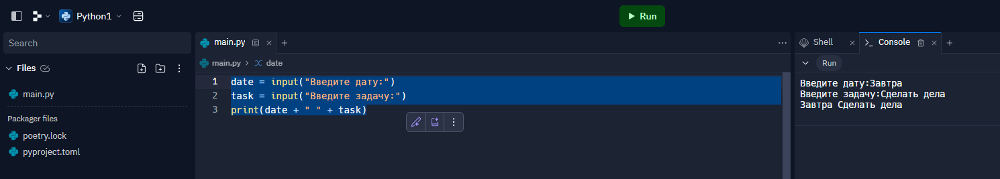

# Домашнее задание к занятию 1. Знакомство с Python

## Задание 1
Напишите программу, которая последовательно запрашивает у пользователя Дату и Описание задачи, а затем выводит их через пробел.

## Решение

## Задание 2
Модифицируйте программу из задания 1 таким образом, чтобы запрос даты и задачи выполнялся трижды и после этого результаты выводились на экран построчно в формате: на одной строчке дата и задача через пробел.

## Решение

## Задание 3
Модифицируйте программу из задания 2 таким образом, чтобы данные не выводились на экран, а сохранялись в словарь. Ключами в этом словаре должны быть даты, а значениями - соответствующие им задачи.

## Решение

